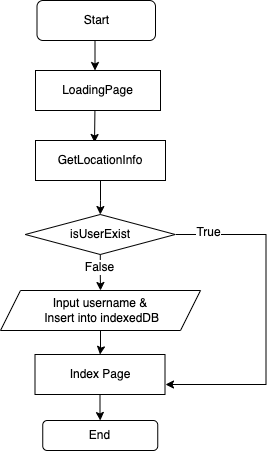
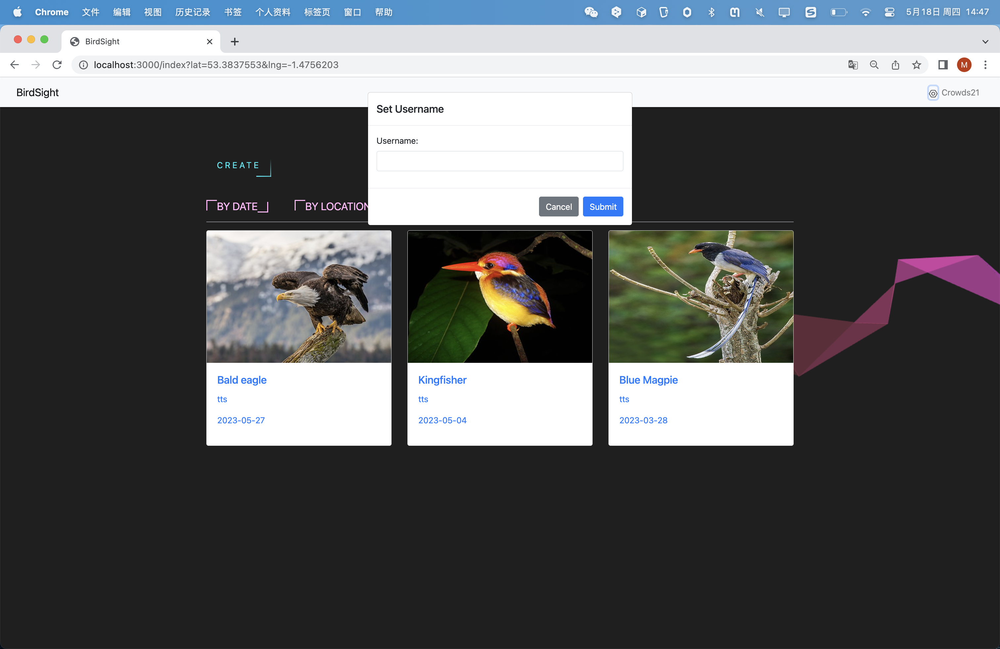
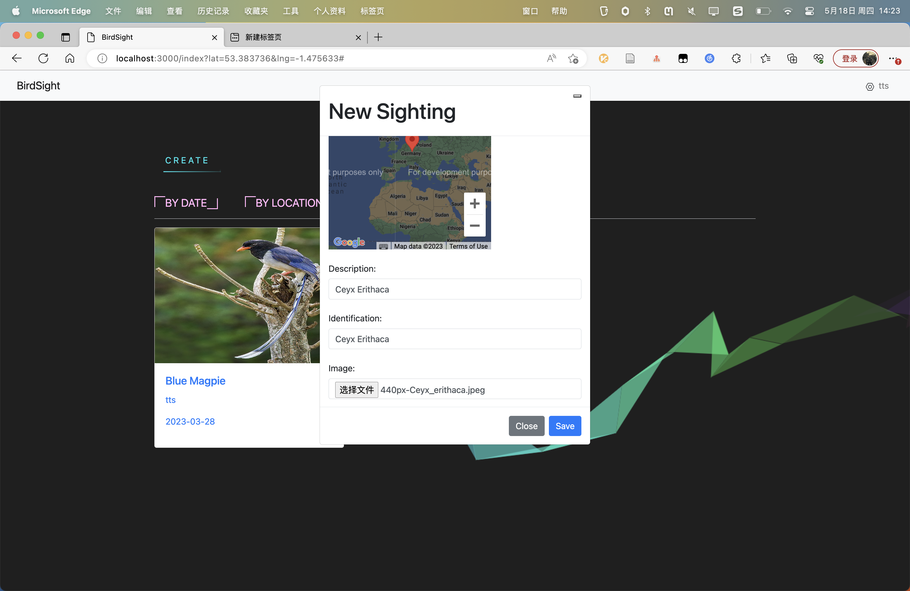
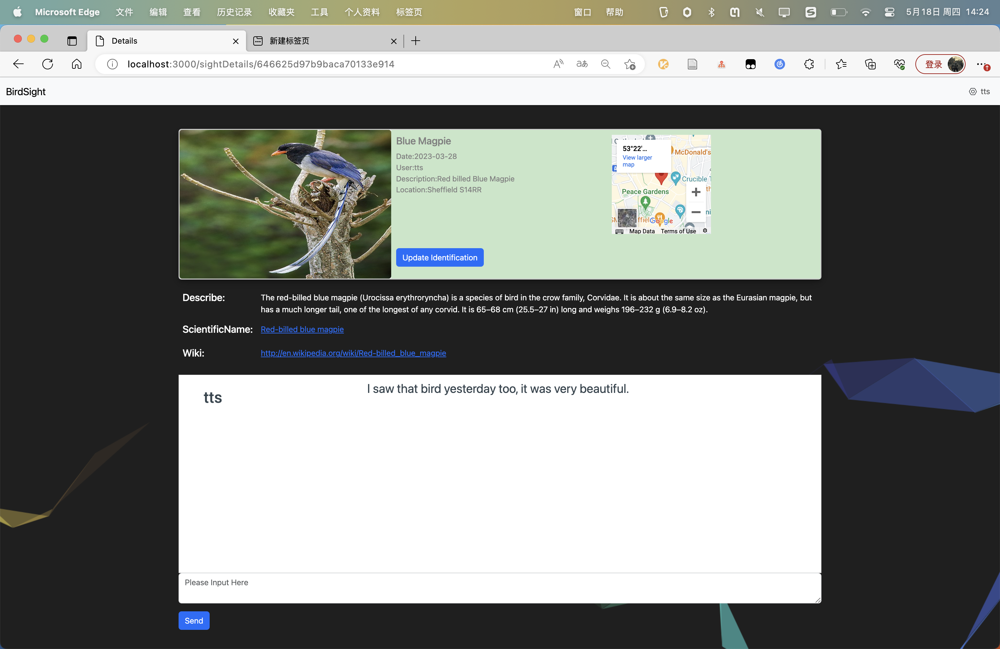
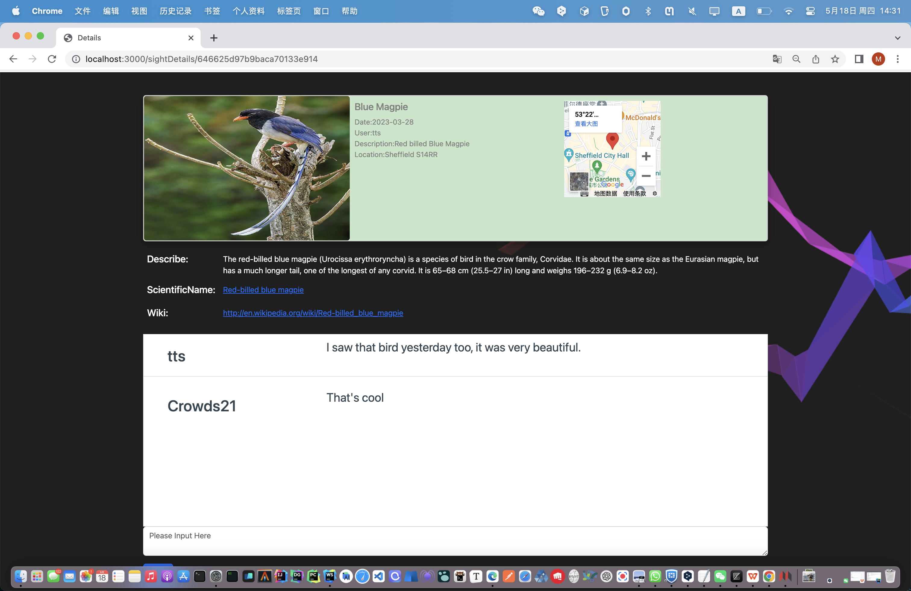

# README

## UserSetting

​​  
The user login process is as follows:

* When the page is opened, a loading screen is displayed, and the user's geographical location is retrieved.
* Upon entering, a query is made in IndexedDB to check if user information exists.
* If there is no user information, a popup window is generated, prompting the user to enter a username. Please note that this step is mandatory.

And, you can change your username anytime.

​​

## Sort by location and time.
Click the corresponding button to view the sorted records.  

## Create new record
Click the corresponding button to view the sorted records.Please note that all information is required.
The user-related information is only stored in the local indexedDB and not saved on the server. Each user is assigned a unique deviceId, and the server uses this ID to determine the creator of the records.

​​

## Detail Page

In the details page, you can see the basic bird information provided by the creator, as well as relevant data obtained from DBPeida. For the creator of the record, they can update the identification by clicking the 'Update' button. Non-creators won't see this button. Additionally, at the bottom, you can find a chat window where you can send messages and chat with other users.

The two images below represent what the creator sees when they open the page and what other users see when they open the page.

Please note that all information is required.

​​

​​

## Offline Usage

You can send and receive messages and create records normally even when you are offline. When you restore your online status, the application will send the messages to the server.‍
